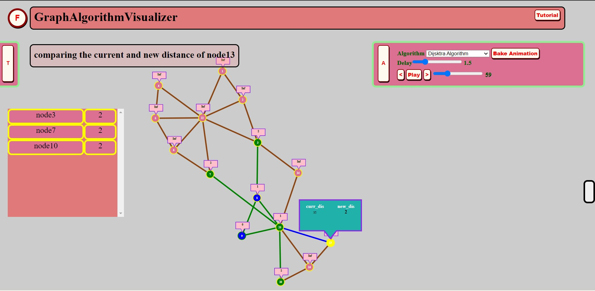

 # Graph Algorithm Visualizer 

* A visualizer website for Graph Algorithms, where you can see a detailed explanation and animations of important algorithm in runtime and build the intuition.
* make or edit your graphs by clicking/drag&drop on the drawing board.
* also contains a script editor to make your graph from script(if it's taking longer to draw by clicking)(feature unstable but still you can give it a try).

# Motivation 

I have spent a hard time understanding and viualizing graph-algorithms, so i decided to build a visualizer which will animate the graph in extreme detail and help you to understand and build your intuition for graph algorithm better. Happy learning😃 

# Tech Stack

* Vanila/javascript (didn't feel the use of external libraries till now😅,might use external libraries later in journey of completing this project).
* HTML
* CSS

# Future work.. 

* planning to add more animations 
* build similar project for Sorting

# Acces the Project here
* https://kridacreations.github.io/graph/
* https://algorithmvisualizer.bitbucket.io/

# youtube video for "how to use"
* https://youtu.be/ex5K2wV2pDk

# Screen Shot of the project
### still from visualizing Dijsktra algorithm

# Available animations to visualize :-

* 1)Depth first search(TRAVERSAL ALGORITHM)
* 2)Breadth First search(TRAVERSAL ALGORITHM)
* 3)Dijsktra algorihtm(SHORTEST PATH ALGORITHM)
* 4)Prim's algorithm(MINIMAL SPANING TREE)
* 5)Kruskal algorithm(MINIMAL SPANING TREE)
* 6)Algorithm for finding CUT POINTS

more animations will be added.....

# Instructions to use:-

## INSTRUCTIONS REGARDING NODES:-

* to add a node choose the "add" button from the above panel and click on the workspace a node will be added.
* to delete a node choose the delete button from above pane and click on the node ,the node will be deleted.
* to connect two nodes choose the connect button, click on a node the node will be foccused, now click on other nodes to connect the foccused, to remove the foccus click on a empty place the current foccused node will be removed.
* you can choose the type of connection to add between nodes ,the following are the supported types:- "unidirectional unweighted" "directional unweighted" "unidirectional weighted" "directional weighted".
* to delete a connection between two nodes click on the connections in delete mode.
* to move a node choose the move button, and now you can drag and drop the nodes to desired position.
## INSTRUCTIONS REGARDING WORKSPACE:-

* Use scroll button to zoom in and zoom out.
* click with middle button and drag to move the workspace.

## INSTRUCTIONS REGARDING ANIMATIONS:-

* choose a foccus node.
* choose the desired algorithm.
* click on "bake animation" button to prepare the animation.
* now you can click the "play button" to watch the animation.
* after clicking play the play button will change to stop.
* you can drag the animation slider to jump to desirable stage of animation.
* also you can use the arrow buttons near the play button to move the animation forward anf backward. 

#### Feel free to open a issue if you find a bug